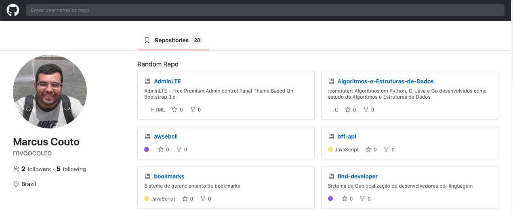
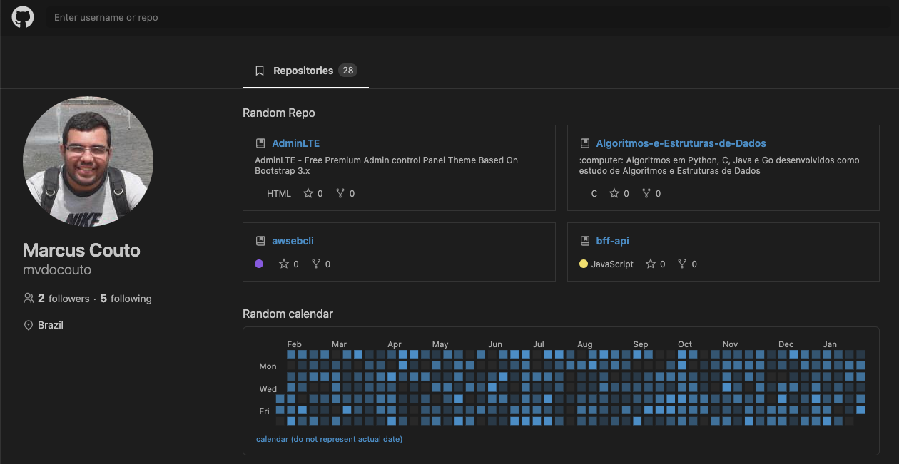

# GitHub clone interface

Clone da interface de uma pagina de usuário. Os dados são carregados uilizando a [GitHub API](https://docs.github.com/pt/rest). A pagina lista os repositórios publicos do usuário.

[](images/ligth.png)

A interface possui uma busca dos perfis dos usuários na base do github. É possivel alternar o thema clicando na logo de Github no ao lado esquerdo da busca.

[](images/dark.png)

## Instalação

```
yarn install
```

## Tecnologias
- Typescript
- React
- react-router-dom
- react-icons
- styled-components

## Executando o projeto
```
yarn start
```